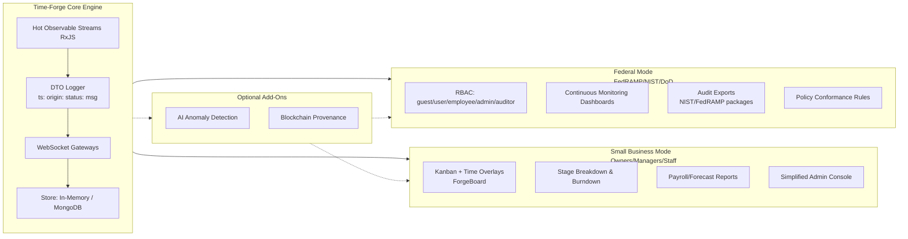
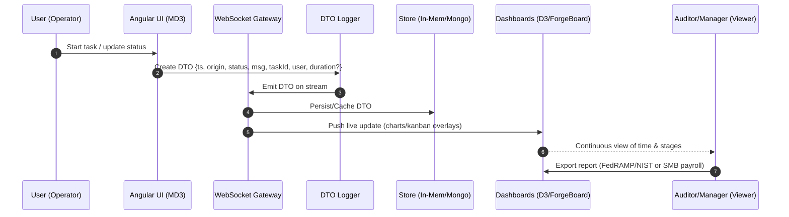

# ⏱️ Time-Forge: Real-Time Time Tracking & Continuous Auditing

## Overview

Time-Forge is a real-time time tracking and auditing platform built to meet federal-grade continuous monitoring requirements (FedRAMP, NIST RMF Rev5, DoD) while remaining lightweight enough for small business adoption.

It eliminates quarterly "snapshot" reporting by generating a living, provable record of time usage. Every action is logged via DTO structures, emitted as RxJS hot observables, and streamed over WebSockets for near-instant provenance.

The same engine that satisfies federal auditors can also power a small business dashboard—making Time-Forge a tool that bridges both worlds.

## Core Features

🔹 **Real-Time DTO Logging**

Every event becomes a strongly typed Data Transfer Object (DTO).

Structured logging with:

- Timestamp
- Origin (UI, API, System)
- Status (start, pause, stop, error)
- Message
- User + Task ID
- Duration

Emitted as RxJS streams, cached in-memory, or stored in MongoDB.

🔹 **Continuous Auditing (Federal Use)**

Mirrors FedRAMP Rev5 continuous monitoring.

Provides live feeds for auditors:

- Resource allocation.
- Contractor activity.
- Bottlenecks and inefficiencies.

Eliminates reliance on static self-attestation.

🔹 **Small Business Mode**

Simplified dashboards for owners/managers.

Visual reports show:

- Where time is spent (production, fulfillment, shipping).
- How long each stage takes.
- Bottlenecks in operations.

Feels approachable—federal rigor hidden under a user-friendly interface.

� **Visual Analytics**

Angular + D3 for charts and dashboards.

Material Design 3 theme, emphasizing clarity and vibrancy.

Built-in visualizations:

- Timeline wheels.
- Burndown charts.
- Stage breakdowns.

## Stakeholder Experience

### Federal Stakeholders (DoD / USACE / OMB / GAO)

**View**: Compliance dashboards, role-based access control, audit exports.

**Value**: Real-time contractor visibility, immutability, elimination of quarterly lag.

### Small Business Stakeholders (Owners, Managers, Staff)

**View**: Kanban overlays, simple charts, payroll-friendly reports.

**Value**: Enterprise-grade auditing, adapted for efficiency and profitability.

## Architecture Contrast



## Time Entry Lifecycle



## DTO Specification

```typescript
export interface TimeForgeDto {
  ts: string;           // ISO short-date-time
  origin: 'ui' | 'api' | 'system' | 'job';
  status: 'start' | 'update' | 'pause' | 'resume' | 'stop' | 'error';
  msg: string;          // human-readable message
  taskId: string;       // kanban/task reference
  user: string;         // actor id
  durationMs?: number;  // filled on update/stop
  tags?: string[];      // stage, project, cost center
  checksum?: string;    // (optional) provenance/hash
}
```

## Roadmap

- **AI-Driven Anomaly Detection** – flagging suspicious time gaps or spikes.
- **Blockchain Provenance** – optional immutable logging for federal-grade or consumer trust.
- **Cross-Project Intelligence** – aggregate views across federal contracts and entrepreneurial ventures.

✅ **In short**: Time-Forge is a continuous auditing engine that satisfies federal oversight while remaining nimble enough to power a small business dashboard.

## Developer Guide

### 🚀 Quick Start

#### Web Development

```bash
# Start frontend and backend for web development
npm run start:all

# Start with development environment (in-memory MongoDB)
npm run start:all:dev
```

#### Android Development

```bash
# Start full Android development stack (frontend + backend + Android app)
npm run start:all:android:dev
```

### 📋 Available Scripts

#### 🌐 Web Development Commands

| Command | Description |
|---------|-------------|
| `npm run start:frontend` | Frontend only (Angular dev server) |
| `npm run start:frontend:android` | Frontend with network access for Android (0.0.0.0:4200) |
| `npm run start:backend` | Backend only (NestJS API with persistent MongoDB) |
| `npm run start:backend:dev` | Backend with in-memory MongoDB for development |
| `npm run start:all` | Frontend + Backend (persistent DB) |
| `npm run start:all:dev` | Frontend + Backend (in-memory DB) - **Recommended for development** |
| `npm run start:all:dev:legacy` | Legacy concurrent startup method |

#### 📱 Mobile Development Commands

| Command | Description |
|---------|-------------|
| `npm run start:all:android:dev` | **Full Android stack** - Frontend + Backend + Android app |
| `npm run android:dev` | Android app only (requires servers running separately) |
| `npm run android:build` | Build web app, sync to Android, and open in Android Studio |
| `npm run android:sync` | Sync web assets to Android platform |
| `npm run android:open` | Open Android project in Android Studio |

#### 🍎 iOS Development Commands

| Command | Description |
|---------|-------------|
| `npm run ios:build` | Build web app, sync to iOS, and open in Xcode |
| `npm run ios:sync` | Sync web assets to iOS platform |
| `npm run ios:open` | Open iOS project in Xcode |

#### 🔧 Build & Utility Commands

| Command | Description |
|---------|-------------|
| `npm run build:frontend` | Build Angular frontend for production |
| `npm run build:backend` | Build NestJS backend for production |
| `npm run build:android` | Build frontend and sync to Android |
| `npm run cap:sync` | Sync web assets to all Capacitor platforms |
| `npm run cap:copy` | Copy web assets to native platforms |

#### 🧹 Code Quality Commands

| Command | Description |
|---------|-------------|
| `npm run lint:all` | Run linting on all projects |
| `npm run lint:md` | Lint all Markdown files |
| `npm run lint:md:fix` | Auto-fix Markdown linting issues |

#### 🛠️ Utility Commands

| Command | Description |
|---------|-------------|
| `npm run prepare` | Install Husky git hooks |
| `npm run backfill:projects` | Backfill project IDs from git history |

### 🏗️ Architecture & Tech Stack

#### Frontend (Angular 20)

- **Location**: `apps/time-tracker/`
- **Port**: `4200` (web), `0.0.0.0:4200` (Android development)
- **Features**: Material Design 3, Real-time DTO streams, D3 visualizations

#### Backend (NestJS)

- **Location**: `apps/api/`
- **Port**: `3000`
- **Database**: MongoDB (persistent) or MongoMemoryServer (development)
- **Features**: WebSocket gateways, DTO logging, Continuous monitoring APIs

#### Mobile (Capacitor 7)

- **Platforms**: Android, iOS
- **Target**: Pixel 9 Pro emulator (Android)
- **Configuration**: `capacitor.config.ts`

### 🔧 Development Workflow

#### 1. Web Development

```bash
# Start development servers with in-memory database
npm run start:all:dev

# Navigate to http://localhost:4200
# API available at http://localhost:3000/api
```

#### 2. Android Development

```bash
# Start full Android development stack
npm run start:all:android:dev
```

This command will:

1. **Start Frontend** with network access (`0.0.0.0:4200`)
2. **Start Backend** with in-memory MongoDB
3. **Wait 8 seconds** for servers to initialize
4. **Launch Android App** targeting Pixel 9 Pro with live reload

#### 3. Making Changes

- **Frontend changes**: Automatically reload in both web and Android
- **Backend changes**: Restart the backend service
- **Native changes**: Run `npm run android:sync` or `npm run ios:sync` to update

### 🌍 Network Configuration

#### Web Development URLs

- **Frontend**: `http://localhost:4200`
- **Backend**: `http://localhost:3000`

#### Android Development URLs

- **Frontend (from emulator)**: `http://10.0.2.2:4200`
- **Backend (from emulator)**: `http://10.0.2.2:3000`
- **Host Network**: Uses your local IP address for network access

### 🗃️ Database Configuration

#### Development Mode (`NODE_ENV=development`)

- Uses **MongoMemoryServer** (in-memory database)
- Perfect for testing and development
- No external MongoDB installation required
- Data resets on server restart

#### Production Mode

- Uses persistent MongoDB at `mongodb://localhost:27017/time-tracker`
- Requires MongoDB installation
- Data persists between restarts

### 🐛 Troubleshooting

#### Android Issues

1. **"Webpage not available"**: Ensure frontend is running on `0.0.0.0:4200`
2. **ADB errors**: Check Android SDK path and emulator status
3. **Java errors**: Verify Android Studio JDK installation
4. **Network connectivity**: Use `10.0.2.2` instead of `localhost` from emulator

#### Build Issues

1. **Port conflicts**: Stop existing processes on ports 3000/4200
2. **Environment variables**: Ensure `NODE_ENV` is set correctly
3. **Capacitor sync issues**: Run `npm run cap:sync` to refresh native assets

#### Development Tips

- Use `npm run start:all:dev` for fastest development cycle
- Check `error.log` for detailed error information
- Use browser dev tools for frontend debugging
- Monitor backend logs for API issues
