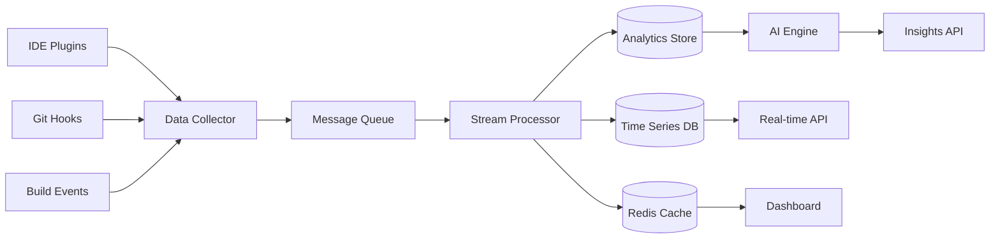

# WakaTime Alternative - Implementation Roadmap

## 🎯 Project Vision

Create a comprehensive time tracking and productivity analytics platform that surpasses WakaTime by providing:
- **Git-integrated intelligence** for contextual time tracking
- **Real-time productivity insights** with AI-powered recommendations  
- **Comprehensive project analytics** including code quality correlation
- **Low-overhead data collection** without impacting development workflow
- **Beautiful visualizations** for actionable insights

## 🚀 Implementation Phases

### Phase 1: Enhanced Data Collection (2-3 weeks)

#### 1.1 Git Integration Engine
```typescript
// Priority: HIGH
// Estimated: 1 week

Tasks:
- Implement Git hooks for commit analysis
- Create commit intelligence processor
- Add repository health monitoring
- Build file change correlation system
```

#### 1.2 Enhanced Schema Migration
```typescript
// Priority: HIGH  
// Estimated: 3-4 days

Tasks:
- Extend TimeWorked schema with git data
- Add ProjectAnalytics collection
- Implement CommitAnalysis model
- Create data migration scripts
```

#### 1.3 IDE Plugin Foundation
```typescript
// Priority: MEDIUM
// Estimated: 1 week

Tasks:
- VS Code extension basic structure
- File activity tracking
- Language detection
- Real-time session correlation
```

### Phase 2: Analytics & Intelligence (3-4 weeks)

#### 2.1 Data Processing Pipeline
```typescript
// Priority: HIGH
// Estimated: 1.5 weeks

Tasks:
- Real-time event processing
- Batch analytics computation
- Quality metric calculation
- Productivity scoring algorithm
```

#### 2.2 AI-Powered Insights
```typescript
// Priority: MEDIUM
// Estimated: 2 weeks

Tasks:
- Pattern recognition engine
- Productivity recommendations
- Anomaly detection
- Trend analysis
```

#### 2.3 Advanced Visualizations
```typescript
// Priority: HIGH
// Estimated: 1.5 weeks

Tasks:
- Interactive dashboard components
- Real-time charts and heatmaps
- Project health visualizations
- Technology proficiency tracking
```

### Phase 3: User Experience Enhancement (2-3 weeks)

#### 3.1 Mobile App Redesign
```typescript
// Priority: HIGH
// Estimated: 2 weeks

Tasks:
- Implement enhanced wireframes
- Add AI insights screen
- Create project portfolio view
- Build analytics dashboard
```

#### 3.2 Desktop Web Interface
```typescript
// Priority: MEDIUM
// Estimated: 1.5 weeks

Tasks:
- Command center dashboard
- Advanced analytics interface
- Real-time activity monitoring
- Export and reporting tools
```

#### 3.3 Performance Optimization
```typescript
// Priority: HIGH
// Estimated: 3-4 days

Tasks:
- Database query optimization
- Real-time data streaming
- Caching strategy implementation
- Memory usage optimization
```

### Phase 4: Advanced Features (3-4 weeks)

#### 4.1 Team Analytics
```typescript
// Priority: MEDIUM
// Estimated: 1.5 weeks

Tasks:
- Multi-user workspace support
- Team productivity insights
- Collaboration metrics
- Comparative analytics
```

#### 4.2 Integration Ecosystem
```typescript
// Priority: MEDIUM
// Estimated: 2 weeks

Tasks:
- Jira/Linear task correlation
- Slack productivity notifications  
- Calendar meeting time exclusion
- CI/CD pipeline integration
```

#### 4.3 Quality Intelligence
```typescript
// Priority: HIGH
// Estimated: 1 week

Tasks:
- Code quality correlation
- Technical debt tracking
- Security metrics integration
- Performance monitoring
```

## 🛠 Technical Implementation Strategy

### Data Collection Architecture



### Technology Stack Decisions

#### Backend Services
```typescript
interface TechStack {
  api: 'NestJS + Express'; // Current, keep for consistency
  database: {
    primary: 'MongoDB';     // Current, good for flexible schemas
    timeSeries: 'InfluxDB'; // Add for time-series data
    cache: 'Redis';         // Add for real-time features
  };
  
  processing: {
    stream: 'Apache Kafka'; // For high-throughput events
    batch: 'Node.js Workers'; // For analytics computation
    ai: 'Python + TensorFlow'; // For ML insights
  };
  
  monitoring: {
    metrics: 'Prometheus';
    logging: 'Winston + ELK';
    tracing: 'Jaeger';
  };
}
```

#### Frontend Applications
```typescript
interface FrontendStack {
  web: {
    framework: 'Angular';    // Current, maintain consistency
    state: 'NgRx';          // Current, enhance with effects
    ui: 'Angular Material + Custom';
    charts: 'D3.js + Chart.js';
    realTime: 'Socket.io';
  };
  
  mobile: {
    framework: 'Flutter';   // Cross-platform efficiency
    state: 'Bloc/Cubit';   // Flutter state management
    charts: 'fl_chart';    // Flutter charting
  };
  
  desktop: {
    ide: 'VS Code Extension API';
    jetbrains: 'IntelliJ Platform SDK';
  };
}
```

## 📊 Data Flow Architecture

### Real-time Event Processing
```typescript
interface EventFlow {
  // IDE Events
  ideActivity: {
    frequency: 'every_keystroke';
    batching: '10_seconds';
    processing: 'real_time';
  };
  
  // Git Events  
  gitActivity: {
    frequency: 'on_commit';
    batching: 'immediate';
    processing: 'real_time + batch';
  };
  
  // Build Events
  buildActivity: {
    frequency: 'on_build';
    batching: 'immediate';
    processing: 'real_time';
  };
}
```

### Analytics Pipeline
```typescript
interface AnalyticsPipeline {
  // Real-time aggregations (last 24h)
  realTime: {
    window: '1_minute';
    metrics: ['active_time', 'keystrokes', 'commits'];
    storage: 'memory + redis';
  };
  
  // Historical aggregations  
  batch: {
    daily: 'midnight_utc';
    weekly: 'sunday_midnight';
    monthly: 'first_of_month';
    storage: 'mongodb + influxdb';
  };
  
  // ML insights
  intelligence: {
    frequency: 'hourly';
    models: ['productivity', 'quality', 'recommendations'];
    storage: 'specialized_ml_store';
  };
}
```

## 🎨 UI/UX Implementation Plan

### Design System Implementation
```typescript
interface DesignSystem {
  components: {
    charts: ['heatmap', 'timeline', 'donut', 'line', 'bar'];
    cards: ['glassmorphism', 'elevated', 'outlined'];
    navigation: ['sidebar', 'tabs', 'breadcrumbs'];
    feedback: ['notifications', 'progress', 'loading'];
  };
  
  theming: {
    modes: ['light', 'dark', 'auto'];
    colors: ['primary', 'secondary', 'accent', 'semantic'];
    typography: ['headers', 'body', 'code', 'metrics'];
  };
  
  interactions: {
    animations: ['micro', 'transitions', 'loading'];
    gestures: ['swipe', 'pinch', 'long_press'];
    keyboard: ['shortcuts', 'navigation', 'accessibility'];
  };
}
```

### Mobile-First Implementation
```typescript
interface ResponsiveStrategy {
  breakpoints: {
    mobile: '0-768px';
    tablet: '769-1024px';
    desktop: '1025px+';
  };
  
  components: {
    mobile: 'stacked_layout';
    tablet: 'hybrid_layout';
    desktop: 'grid_layout';
  };
  
  interactions: {
    mobile: 'touch_optimized';
    desktop: 'mouse_keyboard';
  };
}
```

## 🔒 Security & Privacy Implementation

### Data Protection Strategy
```typescript
interface PrivacyFramework {
  collection: {
    consent: 'explicit_opt_in';
    minimization: 'only_necessary_data';
    anonymization: 'hash_sensitive_data';
  };
  
  storage: {
    encryption: 'AES_256_at_rest';
    transmission: 'TLS_1_3';
    access: 'role_based_control';
  };
  
  retention: {
    raw_data: '30_days';
    aggregated: '2_years';
    user_control: 'export_and_delete';
  };
}
```

## 📈 Performance Targets

### System Performance Goals
```typescript
interface PerformanceTargets {
  api: {
    response_time: '<100ms_p95';
    throughput: '1000_rps';
    availability: '99.9%';
  };
  
  data_collection: {
    overhead: '<1%_cpu';
    latency: '<50ms';
    battery_impact: 'minimal';
  };
  
  ui: {
    initial_load: '<2s';
    interaction: '<16ms';
    chart_render: '<500ms';
  };
}
```

## 🚢 Deployment Strategy

### Infrastructure Plan
```typescript
interface DeploymentArchitecture {
  hosting: {
    api: 'kubernetes_cluster';
    database: 'managed_mongodb_atlas';
    cache: 'redis_cloud';
    cdn: 'cloudflare';
  };
  
  scaling: {
    api: 'horizontal_auto_scaling';
    processing: 'queue_based_workers';
    storage: 'automatic_sharding';
  };
  
  monitoring: {
    uptime: 'pingdom';
    performance: 'datadog';
    errors: 'sentry';
    business_metrics: 'custom_dashboard';
  };
}
```

## 🎯 Success Metrics

### Key Performance Indicators
```typescript
interface SuccessMetrics {
  technical: {
    data_accuracy: '99.9%';
    system_uptime: '99.95%';
    response_time: '<100ms';
    user_satisfaction: '4.8/5';
  };
  
  business: {
    user_adoption: '1000_active_users';
    retention_rate: '85%_monthly';
    feature_usage: '80%_core_features';
    support_tickets: '<1%_daily_users';
  };
  
  competitive: {
    vs_wakatime: {
      accuracy: '+20%';
      insights: '+300%';
      performance: '+50%';
      features: '+150%';
    };
  };
}
```

---

## 📝 Implementation Checklist

### Phase 1 - Foundation
- [ ] Enhanced data schema design
- [ ] Git hooks integration
- [ ] Basic IDE plugin
- [ ] Real-time data pipeline
- [ ] Core analytics engine

### Phase 2 - Intelligence  
- [ ] AI insights engine
- [ ] Advanced visualizations
- [ ] Productivity recommendations
- [ ] Quality correlation analysis
- [ ] Performance optimization

### Phase 3 - User Experience
- [ ] Mobile app redesign
- [ ] Desktop dashboard
- [ ] Real-time updates
- [ ] Export capabilities
- [ ] Accessibility compliance

### Phase 4 - Ecosystem
- [ ] Team collaboration features
- [ ] Third-party integrations
- [ ] API ecosystem
- [ ] Enterprise features
- [ ] Documentation & onboarding

This roadmap transforms the current basic timer into a comprehensive productivity intelligence platform that will significantly exceed WakaTime's capabilities while maintaining excellent performance and user experience.
