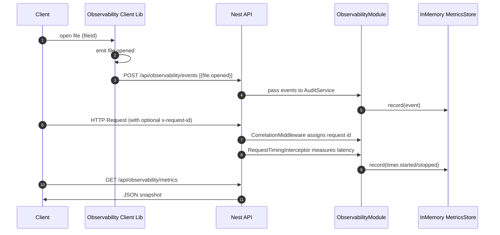
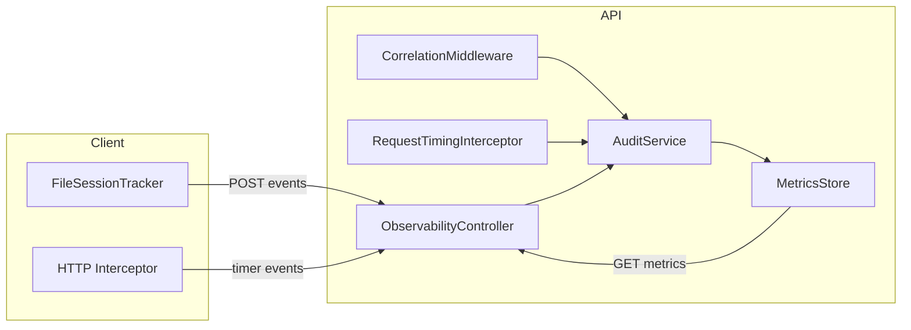

# Observability & Audit Architecture

> Status: Initial Implementation (Phase 1)  
> Scope: Request correlation, timing metrics, audit event ingestion, file session & security event model.

## Goals

- Provide low-friction, opt-in instrumentation for API & client.
- Capture structured audit events (tasks, timers, file sessions, security events, seeding) with correlation IDs.
- Offer lightweight in-memory metrics (counts, file session duration percentiles) for rapid feedback during development.
- Lay groundwork for future persistence (Mongo or time-series DB), streaming (SSE/WebSocket), and external metrics export (Prometheus/OpenTelemetry).

## High-Level Flow



## Components

| Component                  | Location               | Responsibility                                                                 |
| -------------------------- | ---------------------- | ------------------------------------------------------------------------------ |
| `CorrelationMiddleware`    | `observability/server` | Ensures every inbound HTTP request has `x-request-id` (existing or generated). |
| `RequestTimingInterceptor` | `observability/server` | Emits timer events for duration; future: histogram export.                     |
| `AuditService`             | `observability/server` | Central emitter for structured audit events; logs + forwards to metrics store. |
| `MetricsStore`             | `observability/server` | In-memory aggregation (counts, file session duration stats).                   |
| `ObservabilityController`  | `observability/server` | `POST /api/observability/events`, `GET /api/observability/metrics`.            |
| `FileSessionTracker`       | `observability/client` | Tracks open/close/persist lifecycle, emits audit events.                       |
| `createObsHttpInterceptor` | `observability/client` | Wraps Angular HTTP requests with timer started/stopped events.                 |

## Event Model (Selected)

| Event Type                  | Purpose                        | Key Fields                              |
| --------------------------- | ------------------------------ | --------------------------------------- |
| `file.opened`               | Start of a file session        | `fileId`, `openedAt`, `mode`, `project` |
| `file.closed`               | End of a session               | `durationMs`, `bytesWritten`, `changes` |
| `file.persisted`            | Explicit save/version boundary | `checksum`, `sizeBytes`, `version`      |
| `security.upload.started`   | Begin upload pipeline          | `uploadId`, `filename`                  |
| `security.upload.completed` | Upload done                    | `durationMs`, `checksum`                |
| `security.hash.mismatch`    | Integrity violation            | `expected`, `actual`, `action`          |
| `timer.started/stopped`     | Generic timing spans           | `rid`, `durationMs`                     |
| `seed.run/seed.skipped`     | Data initialization            | `collection`, `inserted`, `reason`      |

Full list defined in `libs/observability/shared/src/lib/audit-events.ts`.

## Metrics Snapshot Schema

`GET /api/observability/metrics` returns:

```json
{
  "counts": { "file.opened": 3, "file.closed": 3, "timer.started": 5, ... },
  "fileSessions": {
    "open": 0,
    "closed": 3,
    "avgDurationMs": 152,
    "p90DurationMs": 210,
    "p99DurationMs": 210
  },
  "security": {
    "uploadsStarted": 1,
    "uploadsCompleted": 1,
    "hashMismatches": 0,
    "accessDenied": 0,
    "scans": 0
  },
  "updatedAt": "2025-09-27T21:58:50.123Z"
}
```

## Environment Gating

Observability activation is controlled by `OBS_ENABLE` environment variable:

- Enabled when `OBS_ENABLE=1` or `true`.
- When disabled: no middleware, interceptor, or controller registration (still safe to emit events in code; they will just log).

## Developer Usage

### Server

1. Import `ObservabilityModule` once in `AppModule` (already done).
2. Ensure `OBS_ENABLE=1` in `start:all` script for dev.
3. Emit custom events (example):

```ts
this.audit.emit({
  type: 'task.created',
  at: new Date().toISOString(),
  data: { taskId, project, title },
});
```

4. Inspect metrics: `curl http://localhost:3000/api/observability/metrics`.

### Client (Angular)

1. Provide emitter bridging to backend:

```ts
function backendEmit(e: AnyAuditEvent) {
  fetch('/api/observability/events', { method: 'POST', headers: { 'Content-Type': 'application/json' }, body: JSON.stringify({ events: [e] }) });
}
```

2. Register HTTP interceptor:

```ts
{ provide: HTTP_INTERCEPTORS, multi: true, useValue: createObsHttpInterceptor({ emit: backendEmit, actor: currentUserId }) }
```

3. Track file sessions:

```ts
const tracker = new FileSessionTracker(backendEmit);
tracker.open('file-123', '/docs/spec.md', { project: 'portfolio', mode: 'rw' });
// ... user edits ...
tracker.recordWrite('file-123', 2048, 3);
tracker.close('file-123');
```

## Management / Stakeholder Views

| Concern                               | How Addressed Now                          | Future Enhancement                       |
| ------------------------------------- | ------------------------------------------ | ---------------------------------------- |
| File productivity                     | Duration & change metrics per file session | Persist to DB + trend charts             |
| Task lifecycle traceability           | `task.*` audit events                      | Correlate to commits & time entries      |
| Performance hotspots                  | Request timing events                      | Histogram & APM export via OpenTelemetry |
| Security posture                      | Upload & hash mismatch events              | Automated risk scoring dashboard         |
| Seeding/initialization accountability | `seed.*` events with hash                  | Integrity verification & drift detection |

## Future Roadmap (Suggested)

1. Persistence Layer: Mongo collection `audit_events` with TTL index for raw events; summarized nightly rollups.
2. Streaming: Server-Sent Events endpoint `/api/observability/stream` for live dashboards.
3. Metrics Export: Integrate `prom-client` or OpenTelemetry metrics exporter.
4. Correlation Propagation: Add outbound HTTP client interceptor to forward `x-request-id`.
5. Sampling & Backpressure: Adaptive sampling for high-volume file events.
6. Integrity Drift: Compute & store SHA256 for seed JSON, emit mismatch events on divergence.

## Diagram: Component Relationships



## Operational Considerations

| Topic            | Note                                                                                                         |
| ---------------- | ------------------------------------------------------------------------------------------------------------ |
| Memory Footprint | Durations array grows with closed sessions; implement periodic trimming/decimation for long-lived processes. |
| Clock Source     | Uses `Date.now()`; for high precision adopt `performance.now()` and map to wall time.                        |
| Error Handling   | Metrics recording wrapped in try/catch to avoid cascading failures.                                          |
| Batch Size       | `POST /events` accepts arbitrary `events` array; consider max size & 413 handling later.                     |
| Security         | Endpoint currently unauthenticated; gate via API key / JWT in production.                                    |

## Quick Validation Commands

```bash
# Emit a synthetic file session
curl -X POST http://localhost:3000/api/observability/events \
  -H 'Content-Type: application/json' \
  -d '{"events":[{"type":"file.closed","at":"'$(date -u +%Y-%m-%dT%H:%M:%SZ)'","data":{"fileId":"demo","openedAt":"'$(date -u +%Y-%m-%dT%H:%M:%SZ)'","closedAt":"'$(date -u +%Y-%m-%dT%H:%M:%SZ)'","durationMs":42}}]}'

# Fetch metrics
curl http://localhost:3000/api/observability/metrics | jq
```

---

_End of document._
