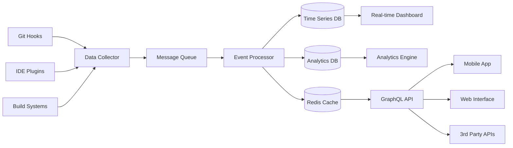

# Enhanced Time Tracker - Use Case Analysis

## Data Collection Strategy

### 🎯 Core Data Sources

#### 1. Git Repository Intelligence
```typescript
interface GitMetrics {
  commitHash: string;
  timestamp: Date;
  author: string;
  filesChanged: string[];
  linesAdded: number;
  linesDeleted: number;
  branch: string;
  commitMessage: string;
  projectPath: string;
  language: string;
  timeSpentCoding: number; // Correlated with timer data
}
```

#### 2. IDE/Editor Activity Tracking
```typescript
interface EditorActivity {
  timestamp: Date;
  editor: 'vscode' | 'jetbrains' | 'vim' | 'sublime';
  projectName: string;
  filePath: string;
  language: string;
  isWriting: boolean;
  lineNumber: number;
  characterCount: number;
  keystrokes: number;
  timeSpent: number;
}
```

#### 3. Build System Intelligence
```typescript
interface BuildMetrics {
  projectName: string;
  buildTool: 'nx' | 'webpack' | 'vite' | 'maven' | 'gradle';
  startTime: Date;
  endTime: Date;
  success: boolean;
  testsRun: number;
  testsPassed: number;
  bundleSize?: number;
  dependencies: string[];
}
```

#### 4. Framework & Technology Detection
```typescript
interface TechnologyStack {
  projectName: string;
  frameworks: string[]; // ['angular', 'nestjs', 'nx']
  languages: string[];  // ['typescript', 'scss', 'html']
  databases: string[];  // ['mongodb', 'postgres']
  tools: string[];      // ['eslint', 'prettier', 'vitest']
  dependencies: PackageMetrics[];
}
```

### 📊 Enhanced Data Models

#### Project Analytics
```typescript
interface ProjectAnalytics {
  id: string;
  name: string;
  description: string;
  repository: string;
  totalTime: number;
  activeTime: number; // Actual coding time
  technologies: TechnologyStack;
  productivity: ProductivityMetrics;
  quality: QualityMetrics;
  timeline: TimelineEvent[];
}
```

#### Productivity Metrics
```typescript
interface ProductivityMetrics {
  codeVelocity: number;        // Lines per hour
  commitFrequency: number;     // Commits per day
  testCoverage: number;        // Percentage
  bugRate: number;            // Bugs per 1000 lines
  refactoringTime: number;    // Time spent refactoring
  documentationRatio: number; // Docs vs code time
  focusTime: number;          // Uninterrupted coding periods
}
```

#### Quality Metrics
```typescript
interface QualityMetrics {
  codeComplexity: number;
  duplicationPercentage: number;
  technicalDebt: number;
  securityIssues: number;
  performanceMetrics: PerformanceData;
  codeReviewTime: number;
}
```

### 🔍 Git Commit Analysis Engine

#### Intelligent Commit Parsing
```typescript
class GitAnalyzer {
  async analyzeCommit(commit: GitCommit): Promise<CommitInsights> {
    return {
      type: this.classifyCommitType(commit.message),
      impact: this.calculateImpact(commit.changes),
      complexity: this.assessComplexity(commit.changes),
      estimatedTime: this.estimateTimeSpent(commit),
      relatedFeatures: this.extractFeatureReferences(commit.message),
      codeQuality: await this.analyzeCodeQuality(commit.changes)
    };
  }
  
  private classifyCommitType(message: string): CommitType {
    // feat, fix, docs, style, refactor, test, chore
    const patterns = {
      feature: /^(feat|feature)/i,
      bugfix: /^(fix|bug)/i,
      documentation: /^(docs|doc)/i,
      refactor: /^(refactor|ref)/i,
      test: /^(test|spec)/i,
      style: /^(style|format)/i,
      chore: /^(chore|build|ci)/i
    };
    
    for (const [type, pattern] of Object.entries(patterns)) {
      if (pattern.test(message)) return type as CommitType;
    }
    return 'other';
  }
}
```

### 🎨 Data Visualization Components

#### Real-time Activity Heatmap
```typescript
interface ActivityHeatmap {
  date: string;
  hour: number;
  intensity: number; // 0-100
  projectName: string;
  language: string;
  activity: 'coding' | 'debugging' | 'testing' | 'docs';
}
```

#### Language Proficiency Tracking
```typescript
interface LanguageProficiency {
  language: string;
  timeSpent: number;
  linesWritten: number;
  projectsUsed: string[];
  proficiencyLevel: 'beginner' | 'intermediate' | 'advanced' | 'expert';
  recentActivity: ActivityTrend[];
}
```

### 🚀 System Architecture for Data Collection

#### Low-Overhead Collection Strategy
```typescript
interface DataCollectionStrategy {
  gitHooks: {
    preCommit: boolean;    // Analyze staged changes
    postCommit: boolean;   // Record commit metrics
    prePush: boolean;      // Validate quality gates
  };
  
  idePlugins: {
    fileWatcher: boolean;  // Track file modifications
    keystrokeLogger: boolean; // Measure typing activity
    focusTracker: boolean; // Track window focus time
  };
  
  buildIntegration: {
    webhooks: boolean;     // Build status notifications
    metrics: boolean;      // Performance and timing data
    artifacts: boolean;    // Bundle analysis
  };
  
  backgroundServices: {
    gitAnalyzer: boolean;  // Periodic repository analysis
    qualityChecker: boolean; // Code quality monitoring
    timeAggregator: boolean; // Roll up time data
  };
}
```

### 📈 Performance Optimization

#### Efficient Data Storage
```typescript
interface OptimizedStorage {
  timeSeries: {
    raw: '7_days';        // Full resolution for recent data
    hourly: '30_days';    // Hourly aggregates
    daily: '1_year';      // Daily summaries
    monthly: 'forever';   // Long-term trends
  };
  
  indexing: {
    timeRange: boolean;   // Fast time-based queries
    project: boolean;     // Project-specific analytics
    language: boolean;    // Language trend analysis
    user: boolean;        // Multi-user support
  };
  
  caching: {
    dashboards: '5_minutes';
    reports: '1_hour';
    analytics: '1_day';
  };
}
```

### 🔄 Real-time Data Pipeline



## Integration Points

### 1. Nx Workspace Intelligence
- Leverage Nx project graph for dependency analysis
- Track inter-project time allocation
- Monitor build cache effectiveness
- Analyze task execution patterns

### 2. Git Repository Mining
- Historical analysis of development patterns
- Author contribution analytics
- Code evolution tracking
- Merge conflict analysis

### 3. IDE Extensions
- VS Code extension for real-time tracking
- JetBrains plugin support
- Language server protocol integration
- Syntax highlighting time tracking

### 4. Build System Hooks
- Webpack bundle analysis
- Vite development server metrics
- Test execution timing
- Deployment pipeline tracking

---

This comprehensive data collection strategy will provide insights far beyond normal time tracking methodologies, including:
- **Code Quality Correlation**: Link time spent with code quality metrics
- **Productivity Patterns**: Identify optimal working hours and conditions
- **Technology Proficiency**: Track skill development across languages/frameworks
- **Project Health**: Monitor technical debt and maintenance time
- **Team Collaboration**: Analyze code review and pairing time
- **Learning Curves**: Track time investment in new technologies

The system is designed to be lightweight yet comprehensive, using Git commits as a primary intelligence source while supplementing with real-time IDE activity and build system integration.
