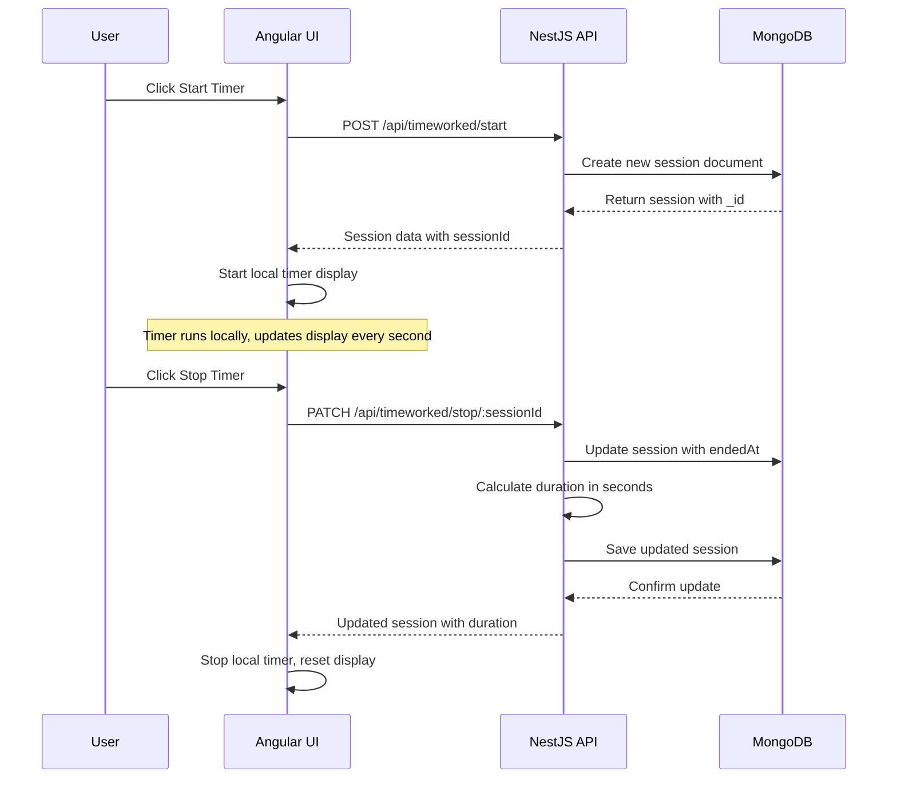
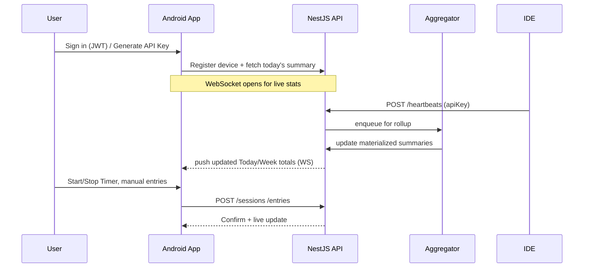

# System Architecture (Current Implementation)

## Current State (Phase 1)
```mermaid
flowchart LR
  UI[Angular Frontend\n(Timer UI)] -->|HTTP REST| API[NestJS API\n(Express + Mongoose)]
  API --> DB[(MongoDB\nTimeWorked Collection)]
  UI -->|Start/Stop Timer| API
  API -->|Session Data| DB
  API -->|Health Check| UI
  
  subgraph "Frontend Features"
    UI --> TIMER[Timer Display]
    UI --> BUTTONS[Start/Stop Buttons]
    UI --> STATUS[Connection Status]
  end
  
  subgraph "Backend Services"
    API --> HEALTH[Health Controller]
    API --> TIMEWORK[TimeWorked Controller]
    API --> SERVICE[TimeWorked Service]
  end
```

## Future Architecture (Target State)
```mermaid
flowchart LR
  A[IDE Plugins\n(VS Code, JetBrains, Android Studio)] -->|heartbeat| G[/HTTP POST /heartbeats/]
  M[Android App\n(Rx + WebSocket)] -->|start/stop, manual, settings| G
  G[NestJS API Gateway\n(JWT+API Keys, RBAC)] --> I[(Ingest Service)]
  I --> Q[(Queue/Buffer\n(e.g., Redis Stream))]
  Q --> AGG[Aggregator\n(rollups: 5m/1h/d)]
  Q --> RAW[(Postgres/Timescale\nheartbeats, sessions)]
  AGG --> RPT[(Materialized views\nsummaries)]
  G <-->|WS: real-time summaries| M
  G --> ADM[Admin UI\n(optional web)]
```

---

# Client Flow (Current Implementation)



# Future Client Flow (Target State)


