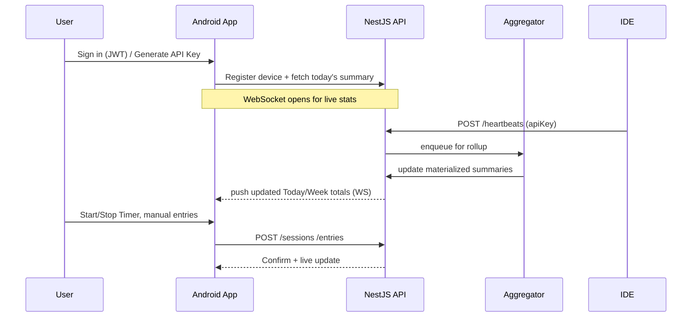

# System Architecture (Mermaid)

```mermaid
flowchart LR
  A[IDE Plugins\n(VS Code, JetBrains, Android Studio)] -->|heartbeat| G[/HTTP POST /heartbeats/]
  M[Android App\n(Rx + WebSocket)] -->|start/stop, manual, settings| G
  G[NestJS API Gateway\n(JWT+API Keys, RBAC)] --> I[(Ingest Service)]
  I --> Q[(Queue/Buffer\n(e.g., Redis Stream))]
  Q --> AGG[Aggregator\n(rollups: 5m/1h/d)]
  Q --> RAW[(Postgres/Timescale\nheartbeats, sessions)]
  AGG --> RPT[(Materialized views\nsummaries)]
  G <-->|WS: real-time summaries| M
  G --> ADM[Admin UI\n(optional web)]
```

---

# Client Flow (Mermaid Sequence Diagram)


